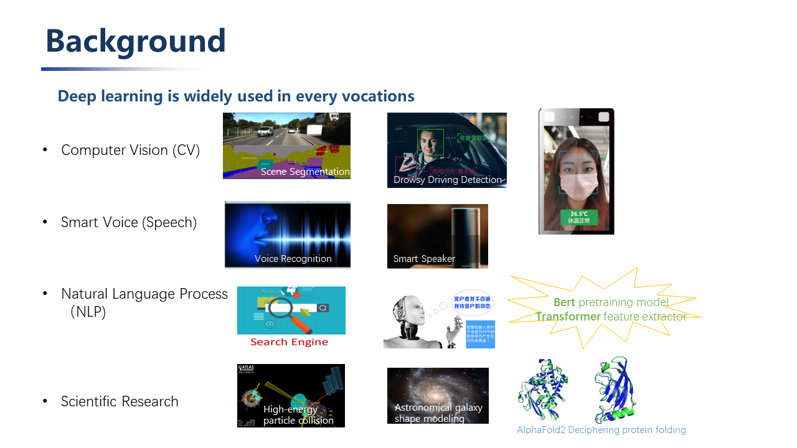

# AutoKernel: To know more about AI Compiler
## Overview of AI Compiler
In recent years, AI technology oriented with machine learning and deep learning has been rapidly developed, and deep neural networks have been widely used in various domains:  
1. CV (computer vision): object detection, scene recognition, image segmentation, etc.  
2. Smart voice: voice recognition, voiceprint recognition, etc.  
3. NLP (Natural Language Processing): automatic search engine, dialogue service robot, text classification, intelligent translation, etc.  
4. Scientific research: applied in many research fields such as physics, biology, medicine, etc. High-energy particle collision classification, cosmic celestial map data analysis, galaxy shape modeling, protein folding prediction of biological structure, precision medical treatment and disease prediction.      
       
  
      
These applications have spawned more new models: CNN, RNN, LSTM, GAN, GNN, and also spawned the emergence of deep learning frameworks such as Tensorflow, Pytorch, Mxnet, and Caffe. At present, the training framework has begun to converge, gradually forming a duo situation where PyTorch leads the academic world and TensorFlow leads the industry.    

However, in order for deep learning algorithms to be implemented, they must be deployed on hardware, such as Google’s TPU, Huawei’s Kirin NPU, and other architectural innovations on FPGA.    
     
  
       
When it comes to how to deploy the models trained by these training frameworks to different terminal hardware, this requires a deep learning neural network compiler to solve this problem.    

Before the emergence of neural network compilers, we used traditional compilers.

**Traditional Compilers：**

Take LLVM (low level virtual machine) as an example, its input is high-level programming language source code, and its output is machine code. It consists of a series of modular compiler components and tool chains.   
LLVM is divided into three parts: front-end, middle-end (optimized) and back-end through modules. Whenever a new programming language appears, only the corresponding front-end needs to be developed, and the programming language is converted into the intermediate representation of LLVM; similarly, when a new hardware architecture appears, only the corresponding back-end needs to be developed and connected to the intermediate representation of LLVM.  
The modularization avoids the problem of compiler adaptability caused by the refurbishment of the programming language and CPU architecture, and greatly simplifies the development of the compiler.   
    
   
     
**Neutral Network Compiler：**

Its input is the model definition file trained by the deep learning training framework, and the output is the code that can be efficiently executed on different hardware. 
      
  
     
It is composed of four levels from top to bottom：  
1. The top layer is connected to the algorithm models trained by various deep learning training frameworks (Tensorflow, Caffe, Pytorch, Mxnet, etc.).    
2. Layer level (High-level IR): The structure of the neural network can be expressed as a calculation graph, and layer-level operations are to perform some operations on the calculation graph that have nothing to do with the specific hardware and framework, such as operator fusion, memory allocation optimization, Derivation of data types and data dimensions, etc.     
      
  
> _We can use operator fusion to avoid frequent direct reading and writing of intermediate data between registers and memory, thereby improving overall inference performance  。_  
     
  
> _Nividia has achieved a threefold increase in inference performance by fusing conv, bn, and relu into one operator fuse-CBR._    
     
3.  Operator level (operator level/kernel level): The operator level is mainly about tensor calculation. In order to realize these calculations efficiently on the hardware and give full play to the performance of the chip, the hardware chip is usually equipped with specially optimized operator calculation libraries, such as Intel's MKL, Nvidia's CuDNN, and TensorRT. This level needs to support every operator implementation of every hardware backend.     
4. Various hardware backends: GPU, ARM CPU, X86 CPU, NPU, etc.     
     
  
>_Since the concept of the deep learning compiler was put forward, various types of compilers have emerged in an endless stream。_  
      
___
## TVM
In the wave of rapid development of compilers, one of the most prominent one is TVM (Tensor Virtual Machine)。  

TVM was first proposed in 2017 as a compiler stack for deep learning systems.     

The design of the first generation of TVM draws on the design ideas of the traditional compiler framework LLVM, and the design abstracts the middle presentation layer. Different models only need to develop corresponding front-end interfaces, and different back-ends only need to develop corresponding back-end interfaces.

TVM is called Tensor Virtual Machine, which belongs to the operator level. It is mainly used for tensor calculation and provides an intermediate representation of the underlying calculation independent of the hardware. Various methods (circular block, cache optimization, etc.) are used to optimize the corresponding calculation. The first generation of layer-level representation is called NNVM (Neural Network Virtual Machine). The design goal of NNVM is to convert the calculation graph from a different deep learning framework into a unified intermediate representation (IR) of the calculation graph and optimize it.     

The first generation of static images has certain defects:
1. Cannot support control flow well, such as branch jump, loop, etc.
2. Can not support the input shape of the calculation graph, depending on the input tensor size model, such as word2vec.

Although Tensorflow has a control interface like tf.cond.Tf.while_loop to solve the first problem to some extent, tf.fold solves the second problem, but this method is not particularly friendly for rookies who have just come into contact with deep learning framework.

The dynamic graphs that appear later abandon the traditional way of calculating graphs that are defined first and then executed, and adopt the mode defined by the calculation graph at runtime. This kind of calculation graph is called a dynamic graph.

The graph calculation layer of the second-generation TVM becomes Relay VM. The main difference between Relay and the first-generation graph calculation indicator NNVM is that in addition to supporting dataflow (static graph), Relay IR can better solve control flow (dynamic graph). It is not only an intermediate representation of a calculation graph, but also supports automatic differentiation.

  

To sum up, the current structure of TVM is:      
1. The highest level supports mainstream deep learning front-end frameworks, including TensorFlow, MXNet, Pytorch, etc.
2. Relay IR supports differentiability. This level performs graph fusion, data rearrangement and other graph optimization operations.       
3. Based on the tensor quantization calculation graph and the hardware primitive-level optimization according to the back-end, autoTVM explores the search space according to the optimization goal and finds the optimal solution.     
4. The backend supports ARM, CUDA/Metal/OpenCL, accelerator VTA (Versatile Tensor Accelerator).       

## Halide  
Halide was proposed in 2012 and is mainly used for automatic optimization. Embedded in C++, it is a programming language specially designed for image processing by MIT researchers. The Halide language is easy to write, simple in grammar, clear in data structure, and can automatically optimize the code, so that the program can achieve better execution efficiency.     
The core idea of its design is to separate algorithm and scheduling. The advantage of this is that in the case of a given algorithm, you only need to adjust its Schedule scheduling options, without having to rewrite the algorithm to implement a different schedule. When adjusting the schedule and exploring the design space, there is no worry that the correctness of the calculation will change due to the rewriting of the algorithm.    

The Algorithm part is mainly the mathematical expression of algorithm description and calculation.   
The Schedule part tells the machine when to allocate memory and how to calculate (block calculation or sequential calculation)-some scheduling strategies have been provided.     
    
   
     
  
> _Different scheduling strategies consider the trade-off between repeated redundant calculations and locality。_    
    
___
## AutoKernel  
Whether the deep learning model can be successfully applied to the terminal and meet the product needs, a key indicator is the reasoning performance of the neural network model.

The current high-performance operator calculation library is mainly developed manually by high-performance computing optimization engineers. However, the continuous emergence of new algorithms/hardware has led to a huge workload of operator-level optimization and development. At the same time, optimizing the code is not a simple task. It requires engineers to be proficient in computer architecture as well as to be familiar with the calculation process of operators.    
There are few talents, high demand, and high technical threshold. Therefore, we believe that operator optimization and automation is the general trend in the future. The original intention of proposing AutoKernel is to automate this process, start small, optimize at the operator level, and realize the automatic generation of optimized code.     
      
  
     
The input of AutoKernel is the calculation description of the operator (such as Conv, Poll, Fc), and the output is the optimized acceleration source code.    
The development of this tool aims to lower the threshold of optimization work, without the knowledge threshold of the underlying assembly, and no need to write the optimization assembly by hand. The assembly code can be generated by directly calling the developed toolkit. At the same time, it also provides a docker environment containing CPU and GPU, no need to deploy development environment, just use docker. You can also integrate the automatically generated operator into the inference framework-Tengine with one click through the provided plug-in-plugin.     
      
  
     
Correspondingly, the AutoKernel at the operator level is mainly divided into three modules,     
1. Op Generator: Operator generator, using the open source Hallide.    
2. AutoSearch: Currently under development, the goal is to automatically search for optimization strategies through machine learning and reinforcement learning commonly used algorithms.   
3. AutoKernel Plugin: Insert the generated automatic operator into Tengine in the form of a plug-in, which complements manual customization.      
     
    
> _The Tengine object layer is connected to different neural network models. The layer-level NNIR includes model analysis and layer optimization, and the operator level includes the high-performance computing library (HCL lib)._      
     
AutoKernel Plugin is mainly divided into two parts: generation and deployment. In the generation part, Halid is used to fill in the algorithm description and scheduling strategy, and the back-end type is specified during execution (which basically covers the current mainstream back-ends). The deployment part is packaged as a Tengine library and directly called.
     
    
      
We believe that with the contribution of more developers, the AutoKernel community will have greater breakthroughs and growth, leaving a strong fortune in the field of deep learning compilers in the future!
