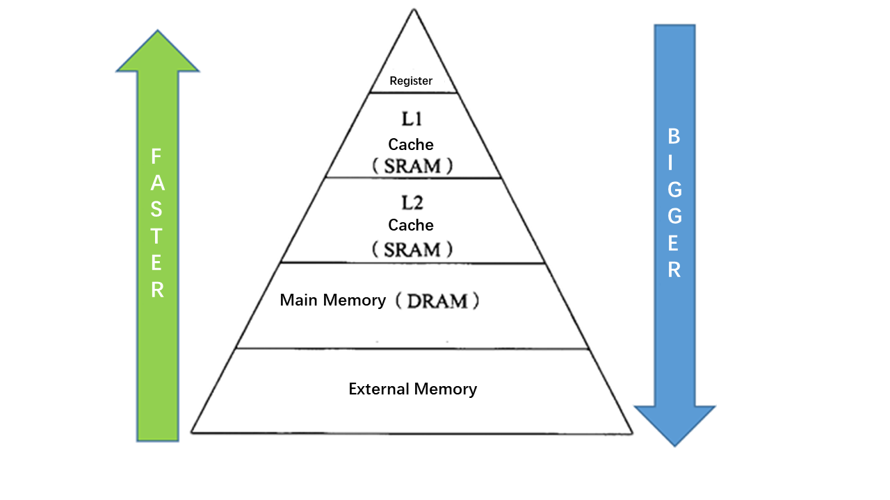

## Optimization tutorial of GEMM on x86  
Here, this tutorial will lead you to optimize the matrix multiplication GEMM step by step. There is no need to manually code, compile complicated and lengthy low-level assembly code, but only need a dozen lines of concise scheduling code.
  
  
  
**Two optimization goals：**     
Before explaining the optimization steps in detail, let's talk about the essence of optimization. When we were talking about "optimization", what did the bottom layer of the computer do? What is the "bottleneck" of optimization? Why can performance be improved through a wave of "optimization operations"? How does Halide used by AutoKernel achieve automatic optimization?    
To answer these questions, we need to understand the basic architecture of the hardware and understand how the hardware works, so that when implementing algorithms in software, we should consider using some of the characteristics of the hardware as much as possible to achieve efficient and extreme optimization.     
  
  
   
   
**Operating environment preparation：**     
AutoKernel provides a docker image, with the running environment being configured, and user can run the demo code directly after entering the docker：     
```  
# Pull mirror 
docker pull openailab/autokernel  
# Start the container and enter the development environment       
docker run -it openailab/autokernel /bin/bash  
# access codes     
git clone https://github.com/OAID/AutoKernel.git  
cd AutoKernel/doc/tutorials/data/  
```  
   
The build.sh in the directory is the execution script of the demo. To run, user need to specify the optimization step 'step'. The optional step is from 1 to 7, where step=1 is not optimized by default, and step=7 is the most optimized.      
**Effect of optimization：**         
```   
# run demo  
./build.sh 1  
./build.sh 7   
```   
  
The following figure shows the optimization effect on a computer with Intel(R) Core(TM) i9-9900K CPU @ 3.60GHz. There is no need to manually write code, no need to write complicated and lengthy low-level assembly code, only a dozen lines of concise scheduling code , The performance can be optimized by 200+ times.    
   
  
   
**Detailed optimizatio steps：**       
**STEP 1**          
The first step is without any optimization. Use Halide language to directly describe the calculation process of GEMM.  
```   
1. Var x,y;
2. RDom k(0, K);
3. Func gemm("gemm");
4. gemm(x, y) += A(k, y) * B(x, k);
```  
Calculate the matrix multiplication of M=N=K=640. The first parameter of the running script specifies step=1. The time-consuming results are as follows：  
```
root@bd3faab0f079:/AutoKernel/doc/tutorials/data# ./06_build.sh 1
step =  1
M N K = 640 640 640     err 0.00        [rep 50] autokernel | blas      240.8523 ms     1.1376 ms   
```   

**STEP 2**          
In this step, we use tiled tiles. The purpose of Tiling is to make full use of the cache. If the original loop is large, the tiles are changed to small pieces of data to calculate, so that the data calculated each time can stay in the cache more comfortably, without repeated eviction (repeat adding and deleting data in the cache) . The reorder operation is performed after the block is divided, the order of the two nested loops is exchanged, and the purpose is to make the innermost memory access friendly. We divide the x and y dimensions into 16x8 small blocks to calculate：  
```   
1.	gemm.update()  
2.	    .tile(x, y, xo, yo, xi, yi, 16, 8)  
3.	    .reorder(xi, yi, k, xo, yo);  
```
   
execution result        
```
root@bd3faab0f079:/AutoKernel/doc/tutorials/data# ./06_build.sh 2
step =  2
M N K = 640 640 640     err 0.00        [rep 50] halide | blas  81.8148 ms      1.1281 ms
```
> Performance has been optimized from 240ms to 82ms, an increase of nearly 3 times.      
   
**STEP 3**            
We add 'vectorize' based on the previous step. Vectorization is to convert several scalar calculations (scale) into a vector calculation (vector), making full use of SIMD vector instructions. Most modern CPUs support SIMD (Single Instruction Multiple Data). In the same CPU cycle, SIMD can execute the same operation/instruction on multiple values at the same time.        
```   
1.	gemm.update()  
2.	       .tile(x, y, xo, yo, xi, yi, 16, 8)  
3.	       .reorder(xi, yi, k, xo, yo)  
4.	       .vectorize(xi, 8);  
```   

execution result       
```   
root@bd3faab0f079:/AutoKernel/doc/tutorials/data# ./06_build.sh 3
step =  3
M N K = 640 640 640     err 0.00        [rep 50] autokernel | blas      27.5433 ms      1.1445 ms
```     
>The performance was optimized from 82ms to 27ms, which was accelerated by nearly 3 times. It can be found that around the two optimization purposes mentioned above: optimizing memory access and improving parallelism, from step1 to step3, the performance has been improved by nearly 9 times.       
   
**STEP 4**          
The scheduling strategy adds parallelization on the basis of step3. Parallelizing a loop is to divide each iteration of the loop into multiple threads or processors for simultaneous processing. Each thread processes through the code segment (loop body), but processes different data.        
```   
1.	gemm(x, y) += A(k, y) * B(x, k);  
2.	gemm.update()  
3.	    .tile(x, y, xo, yo, xi, yi, 16, 8)  
4.	    .reorder(xi, yi, k, xo, yo)  
5.	    .vectorize(xi, 8)  
6.	    .parallel(yo); 
```    
execution result    
```   
root@bd3faab0f079:/home/chunying/AutoKernel/doc/tutorials# ./06_build.sh 4
step =  4
M N K = 640 640 640     err 0.00        [rep 50] autokernel | blas      7.2605 ms       1.1605 ms
```   
> After adding parallelization, build.sh specifies four threads by default, and the performance is directly increased by nearly 4 times, from 27ms to 7.3ms.   
   
**STEP 5**            
The scheduling strategy adds unroll expansion on the basis of the previous step. If the statements in the loop body have no data-related dependencies, loop unrolling can increase the chance of concurrent execution, make full use of registers, and reduce the number of times each operation memory is loaded and saved during the loop.          
```   
1.	gemm.update()  
2.	    .tile(x, y, xo, yo, xi, yi, 16, 8)  
3.	    .reorder(xi, yi, k, xo, yo)  
4.	    .vectorize(xi, 8)  
5.	    .parallel(yo)  
6.	    .unroll(xi)  
7.	    .unroll(yi,2);  
```   
execution result      
```   
root@bd3faab0f079:/AutoKernel/doc/tutorials/data# ./06_build.sh 5
step =  5
M N K = 640 640 640     err 0.00        [rep 50] autokernel | blas      4.7617 ms       1.1597 ms
```   
> After unroll is expanded, the performance is optimized from 7.3ms to 4.8ms.        

**STEP 6**          
The previous block is divided into 16 x 8 small kernels. This step is first divided into 16 x 32 blocks, and then each block is divided into 16 x 8 sub-blocks. We merge the two outermost loops into one layer and parallelize this layer. The calculation description in this step adds a prod function to define the calculation of sub-blocks. The calculation formula of the prod function is the same as the total gemm. We use compute_at to specify the calculation of prod under the one dimension, and the calculation of prod is 16x8. kernel, the general logic is as follows:       
   
   
   
**Codes are listed below：**             
```   
1.	Func prod;  
2.	prod(x, y) += A(k, y) * B(x, k);  
3.	gemm(x, y) = prod(x, y);  
4.	  
5.	gemm.tile(x, y, xi, yi, 16, 32)  
6.	    .fuse(x, y, xy).parallel(xy)  
7.	    .split(yi, yi, yii, 4)  
8.	    .vectorize(xi, 8)  
9.	    .unroll(xi)  
10.	    .unroll(yii);  
11.	  
12.	prod.compute_at(gemm, yi)  
13.	    .vectorize(x, 8).unroll(y);  
14.	  
15.	prod.update()  
16.	    .reorder(x, y, k)  
17.	    .vectorize(x, 8)  
18.	    .unroll(x)  
19.	    .unroll(y)  
20.	    .unroll(k, 2);
```   
execution result   
```  
root@bd3faab0f079:/AutoKernel/doc/tutorials/data# ./06_build.sh 6
step =  6
M N K = 640 640 640     err 0.00        [rep 50] autokernel | blas      3.1824 ms       1.1373 ms
```  
> The performance of this step has been optimized by nearly 80 times from STEP1, and the performance is getting closer and closer to OpenBlas.        

**STEP 7**          
The operation added in this step is to rearrange the data of matrix B to make the memory read smoother when calculating the small kernel 16x8. Because the x dimension of the small kernel is divided according to 16, the x dimension of rearranged data B is also rearranged according to 16.      
   
   
  
**Codes are listed below：**           
```   
1.	Func B_interleave("B"), Bs("Bs");  
2.	Bs(x, y, xo) = B(xo * 16 + x, y);  
3.	B_interleave(x, y) = Bs(x % 16, y, x / 16);  
4.	  
5.	Func prod;  
6.	prod(x, y) += A(k, y) * B_interleave(x, k);  
7.	gemm(x, y) = prod(x, y);  
8.	  
9.	gemm.tile(x, y, xi, yi, 16, 32)  
10.	    .fuse(x, y, xy).parallel(xy)  
11.	    .split(yi, yi, yii, 4)  
12.	    .vectorize(xi, 8)  
13.	    .unroll(xi)  
14.	    .unroll(yii);  
15.	  
16.	prod.compute_at(gemm, yi)  
17.	    .vectorize(x, 8).unroll(y);  
18.	  
19.	prod.update()  
20.	    .reorder(x, y, k)  
21.	    .vectorize(x, 8)  
22.	    .unroll(x)  
23.	    .unroll(y)  
24.	    .unroll(k, 2);  
25.	Bs.compute_root()  
26.	    .split(y, yo, yi, 16)  
27.	    .reorder(x, yi, xo, yo)  
28.	    .unroll(x)  
29.	    .vectorize(yi).parallel(yo, 4);  
```   
execution result   
```
root@bd3faab0f079:/AutoKernel/doc/tutorials/data# ./06_build.sh 7
step =  7
M N K = 640 640 640     err 0.00        [rep 50] autokernel | blas      1.1957 ms       1.1425 ms
```   

So far, every step of our tuning strategy has always been optimized around the two optimization purposes "optimizing memory access" and "improving parallelism". In the end, the performance is almost the same as OpenBlAS, and the distance from STEP1 has been accelerated by 200+ times.     
