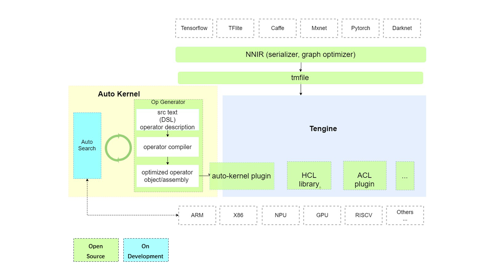

# AutoKernel

## Introduction
Neural networks are now used in a wide variety of applications. Efficient execution of Neural networks on various devices plays a critical role for these applications. Facing the rapid evolution of deep learning algorithms, there are limited qualified programmers to write hand optimized low-level kernels on different hardware platforms. Using automatic optimization tools to generate high-performance implementations become a promising solution.

AutoKernel began as a research project at OPEN AI LAB. The project is now open source. AutoKernel is an operator optimzation tools for automatically generating high-performance low-level codes for diverse hardware backends. It aims to accelerate the development of high performance operators on various hardware including specialized accelerators.

## AutoKernel Architecture

AutoKernel consists of three modules：

**Operator Generator**

  This module uses the open source project [Halide](https://github.com/halide/Halide). Halide is a domain specific language (DSL), embedded in C++, designed to make it easier to write high-performance image processing code on modern machines. Halide seperates the algorithm description from its schedule. The input of this module is the algorithm description of operator, and the output is compiled optimized assembly code/object file for corresponding back-ends.

**AutoSearch**

AutoSearch is an automatic module for searching optimized schedules for halide operators, using multiple optimization algorithms (greedy algorithm, reinforce learning, marchine learning, ...). It supports searching optimized schedules on both CPU and GPU, and generate code files running on different platforms (x86 or arm).

**AutoKernel Plugin**

AutoKernel Plugin realizes one-click integration of auto-generated optimized operator codes into Deep learning inference framework [Tengine](https://github.com/OAID/Tengine), without modifying the core code base of Tengine. AutoKernel plugin "inserts" auto-generated operator implementations into the deployment framework Tengine, enabling the framework to mixed-use both "auto-kernels" and "hand-written kernels".

## Supported backends
Following targets have been tested:
- x86-64-linux
- x86-64-linux-opencl
- x86-64-linux-cuda
- arm-64-linux
- arm-64-linux-opencl

More target archs/features:
- arch:arm, hexagon, mips, powerpc, riscv, wasm, x86.
- bits：32, 64
- os：android, ios, linux, windows...
- features: avx, avx2, avx512, cl_half, cuda, opencl...
