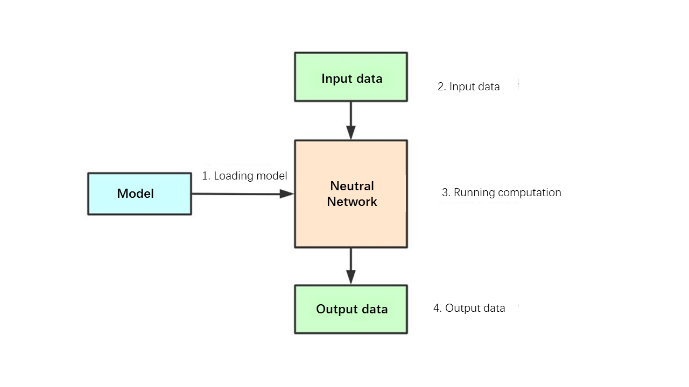

# Tengine: Quick start    

[Tengine](https://github.com/OAID/Tengine) is a lightweight deep neural network inference framework. This document will take the classification model (Squezenet model) as an example (based on the x86 Linux platform) to take you quickly to get started with Tengine.   

## Deep learning neural network calculation process    

**Concept**

-`Neural network`: Neural network can be understood as a graph. A graph is composed of multiple operator nodes. These nodes can be Convolution or Pooling. , Fully connected operator (Fc), etc.    

-`Neural network model`: The neural network model is trained by the deep learning training framework (Tensorflow, Caffe, Pytorch, Mxnet, etc.). The model contains two pieces of information:   
   -The computational graph structure of the neural network   
   -The weight data of the operator    
  
**Calculation process**



1. Load the model: get the neural network structure and weight data   

2. Prepare input data, feed input data   

3. Perform model inference calculations    

4. Get output data    

## Tengine Squeezenet Example  
This example will follow the neural network inference calculation process to demonstrate how to perform the inference calculation of the Squeezenet classification network in Tengine    

1. Loading model
    ```cpp
    /* load model */
    graph_t graph = create_graph(NULL, "tengine", model_file);

    ```
    `model_file`Is a model file in tengine format："squeezenet.tmfile"

2. Prepare input data, feed input data   
    ```cpp
    /* prepare input data */
    tensor_t input_tensor = get_graph_input_tensor(graph, 0, 0);
    set_tensor_shape(input_tensor, dims, 4);
    set_tensor_buffer(input_tensor, input_data, img_size * sizeof(float));
    ```

3. Perform model inference calculations   
    ```cpp
    /* forward */
    run_graph(graph, 1);
    ```
4. Get output data   
    ```cpp
    /* get result */
    tensor_t output_tensor = get_graph_output_tensor(graph, 0, 0);
    float* output_data = ( float* )get_tensor_buffer(output_tensor);
    ```
* codes：
    - The full codes see here: [data/02_tengine_tutorial.cpp](halide/data/02_tengine_tutorial.cpp).
    - Tool functions see here: [tengine_operations.h](https://github.com/OAID/Tengine/blob/tengine-lite/examples/common/tengine_operations.h)中

* Compile
    ```
    cd tutorials/data
    cp /workspace/Tengine/examples/common -r .
    mkdir build
    cd build
    cmake ..
    make
    ```
* Execute
    ```
    cd tutorials/data/build

    #Download model & figure
    wget https://github.com/OAID/TengineModels/raw/main/images/cat.jpg .
    wget https://github.com/OAID/TengineModels/raw/main/tmfiles/squeezenet.tmfile .
    ./02_tengine_tutorial
    ```
    Get results
    ```
    0.273198, 281
    0.267550, 282
    0.181006, 278
    0.081798, 285
    0.072406, 151
    --------------------------------------
    ALL TEST DONE
    ```
    This is a classification network, 1000 classes, index from 0 to 999, each category has a probability score, the running result prints out the top 5 probability scores and index.     


## More Tengine Examples
More Tengine application examples are in [Tengine/examples](https://github.com/OAID/Tengine/tree/tengine-lite/examples):   
- Classification
- Face key point detection
- ssd target detection
- retinaface face detection
- yolact instance segmentation
- yolov3 target detection
- yolov4-tiny target detection
- openpose human body gesture recognition
- crnn Chinese character recognition
